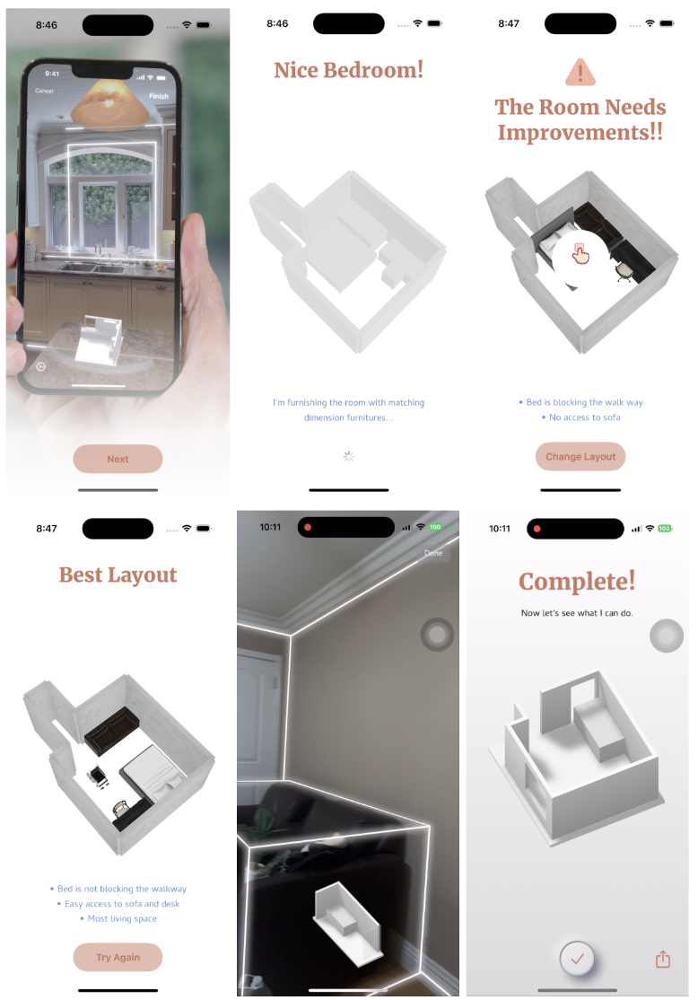

# DingDong - Wheelchair-Friendly Room Layout App

## Overview
Dingdong is an iOS app designed to help wheelchair users optimize their living spaces. Using Apple’s RoomPlan API, the app scans rooms and generates the best furniture arrangement for accessibility. It ensures clear pathways and ergonomic placement, making spaces more comfortable and functional for wheelchair users.

## Features
- **Room Scanning**: Uses Apple’s RoomPlan API to capture and analyze room layouts from USDZ files.
- **Wheelchair Accessibility**: Arranges furniture to create open pathways for wheelchair users.
- **Fast Processing**: Reduces room scan-to-layout time from 12s to 3.5s for a smoother experience.
- **Apple Swift Student Challenge 2025 Entry**: Submitted as an innovative solution for accessibility.

## Installation
1. Clone this repository:
   ```sh
   git clone https://github.com/yourusername/dingdong.git
   ```
2. Open the project in Xcode.
3. Build and run the app on an iOS device or simulator.

## Technologies Used
- Swift
- SwiftUI
- RealityKit
- RoomPlan API

## Images


## Future Improvements
- User customization options for preferred layouts.
- Support for additional accessibility features like voice control.

## Contribution
If you’d like to contribute, feel free to submit a pull request or report any issues!

## License
This project is licensed under the MIT License.

